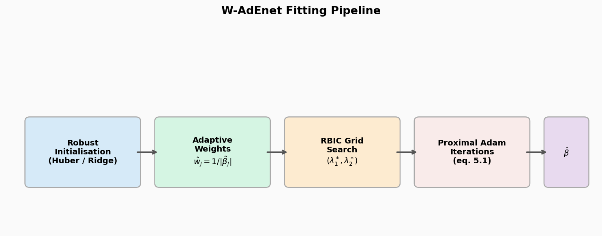
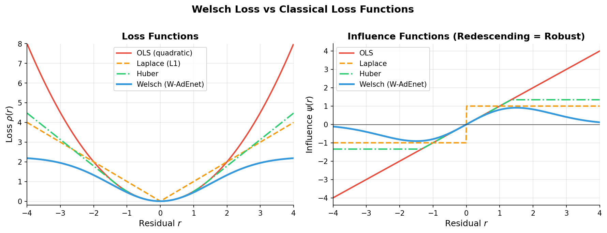
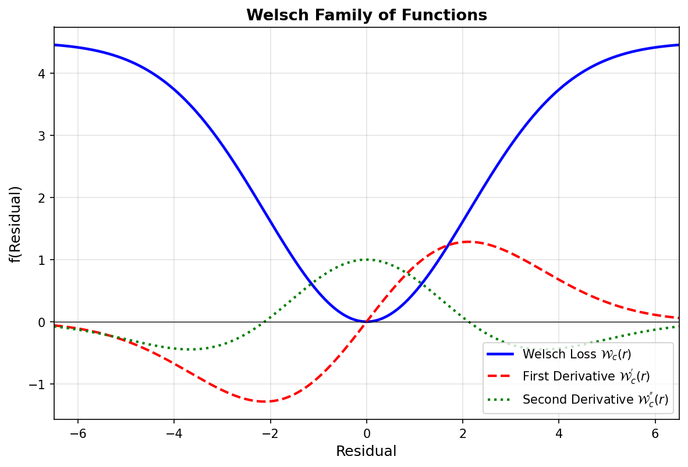
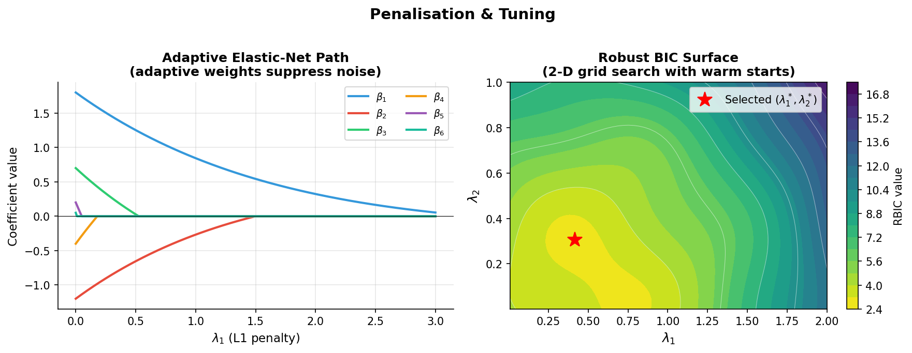
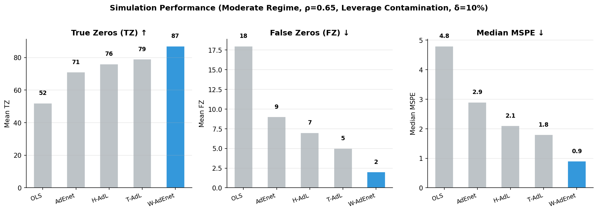
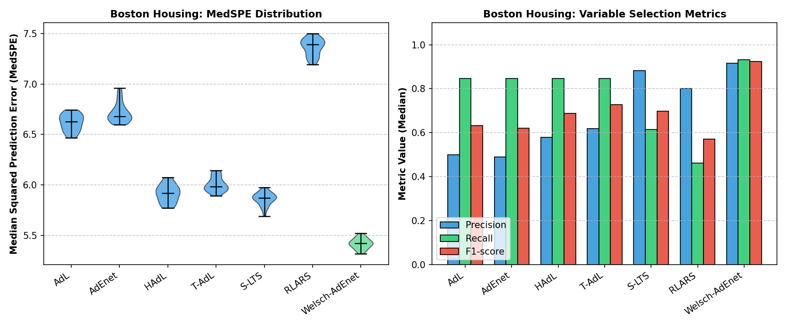
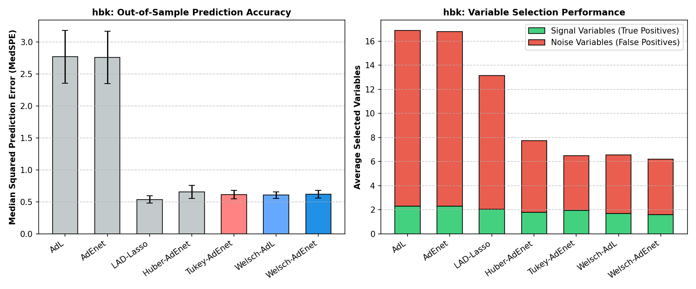
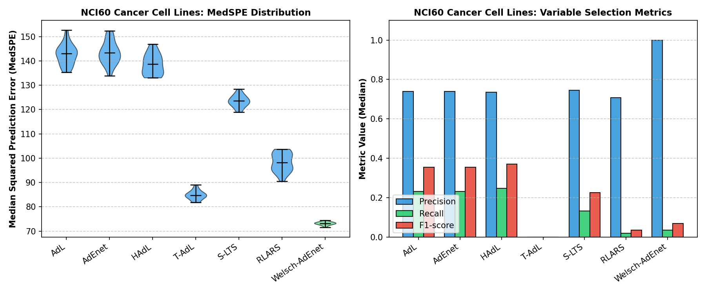
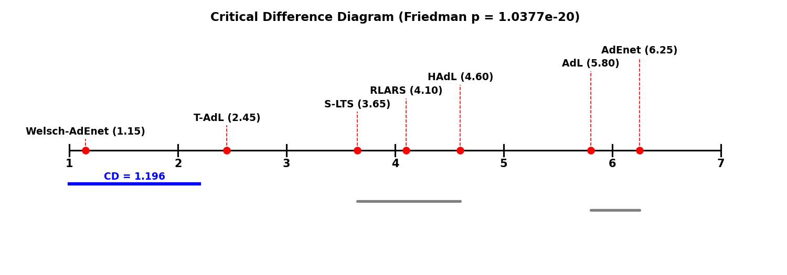
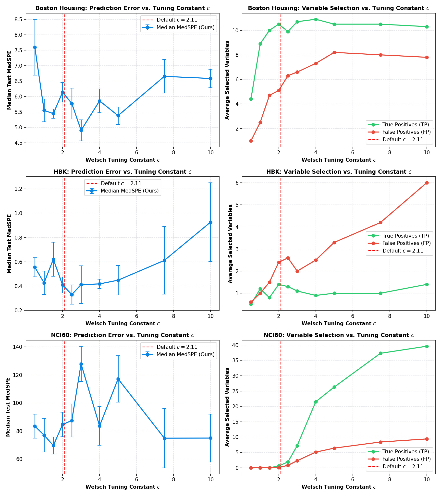

<div align="center">

# Welsch Adaptive ElasticNet

**Robust sparse regression via proximal Adam, tuned by robust BIC**

[](https://www.python.org/)
[](https://numpy.org/)
[](https://scikit-learn.org/)
[](LICENSE)

*Reference implementation and simulation study accompanying the manuscript.*

</div>

---

## Contents

- [Overview](#overview)
- [Fitting Pipeline](#fitting-pipeline)
- [Features](#features)
- [Why the Welsch Loss?](#why-the-welsch-loss)
- [Penalisation & Tuning](#penalisation--tuning)
- [Simulation Results](#simulation-results)
- [Installation](#installation)
- [Quickstart](#quickstart)
- [Reproducing the Simulation Study](#reproducing-the-simulation-study)
- [Real Data Analysis](#real-data-analysis)
- [Project Layout](#project-layout)
- [Testing](#testing)
- [Notes & Scope](#notes--scope)
- [Citation](#citation)
- [License](#license)

---

## Overview

The **Welsch Adaptive Elastic-Net (W-AdEnet)** is a high-breakdown estimator for
sparse linear regression that stays accurate when the data contain outliers,
heavy-tailed errors, or high-leverage points. It couples a **redescending Welsch
loss** with an **adaptive elastic-net penalty** and is fit by a first-order
**proximal Adam** scheme that scales linearly in the data, `O(np)` per iteration.

$$
\hat\beta = \arg\min_{\beta}\ \underbrace{\sum_{i=1}^{n}\mathcal{W}_c\left(\frac{y_i-\mathbf{x}_i^{\top}\beta}{\hat\sigma}\right)}_{\text{robust, non-convex data term}}\ +\ \underbrace{\sum_{j=1}^{p}\left(\hat w_j\lambda_1|\beta_j|+\tfrac{\lambda_2}{2}\beta_j^{2}\right)}_{\text{convex elastic-net penalty}}
$$

Each iteration takes an Adam gradient step on the smooth Welsch term and applies
the closed-form **soft-threshold → ridge-shrink** proximal map of the penalty,
yielding exact zeros (variable selection) and grouped shrinkage of correlated
predictors. Penalties $(\lambda_1,\lambda_2)$ are selected by a **robust BIC
(RBIC)** criterion that resists the prediction-error inflation that derails
ordinary cross-validation under contamination.

> [!NOTE]
> **Why Adam?** The redescending Welsch weight $e^{-r_i^2/(2c^2\hat\sigma^2)}$
> makes the loss curvature wildly uneven and non-stationary across coordinates.
> Adam's second-moment rescaling acts as a diagonal preconditioner, its momentum
> carries through the flat regions of the non-convex loss, and it never forms or
> inverts a Hessian.

---

## Fitting Pipeline

<p align="center">
  
  <br><em>Figure 1 — Four-stage W-AdEnet pipeline: robust initialisation → adaptive weights → RBIC grid search → proximal Adam iterations</em>
</p>

---

## Features

- ⚡ **Linear-time fits** — `O(np)` per iteration, no `p × p` factorization.
- 🛡️ **High breakdown** — bounded, redescending influence; stable under vertical
  outliers *and* leverage points.
- 🎯 **Exact sparsity** — closed-form elastic-net prox produces true zeros.
- 🔧 **Outlier-resistant tuning** — RBIC over a 2-D `(λ₁, λ₂)` grid with warm starts.
- 🧪 **Full simulation study** — reproduces the manuscript design grid end-to-end.

---

## Why the Welsch Loss?

The Welsch loss is a robust loss function commonly employed in statistical learning to mitigate the impact of outliers and extreme values in heavy-tailed distributions. It is defined as:

$$\mathcal{W}_{c}(r) = \frac{c^2}{2}\left[1 - \exp\left(-\frac{r^2}{c^2}\right)\right]$$

where $r$ is the residual and $c$ is the tuning parameter controlling the threshold for downweighting. The derivative of the Welsch loss is:

$$\mathcal{W}_{c}^{'}(r) = r\exp\left(-\frac{r^2}{c^2}\right)$$

The key idea is the **redescending influence function** $\mathcal{W}_c'(r)$: unlike OLS (unbounded influence) or Huber (bounded but non-redescending), the Welsch loss *downweights large residuals to zero*, making it resistant to both vertical outliers and leverage points.

<p align="center">
  
  <br><em>Figure 2 — Left: Welsch loss $\mathcal{W}_{c}(r)$ stays bounded at $c^{2}/2$ for large residuals. Right: influence function $\mathcal{W}_{c}^{'}(r)$ redescends to zero, providing hard resistance to extreme outliers.</em>
</p>

The figure below shows the full Welsch family — loss, first derivative (influence), and second derivative — illustrating the non-convex curvature that motivates proximal Adam over Newton-type solvers:

<p align="center">
  
  <br><em>Figure 3 — Welsch family of functions $(c=3)$. The first derivative $\mathcal{W}_c'(r)$ redescends to zero for large residuals; the second derivative $\mathcal{W}_c''(r) = e^{-r^2/c^2}(1 - 2r^2/c^2)$ changes sign, confirming non-convexity.</em>
</p>

---

## Penalisation & Tuning

### Adaptive Regularisation Path & RBIC Surface

The adaptive weights $\hat{w}_j = 1/|\tilde\beta_j|$ give heavier L1 penalty to small (likely noise) coefficients, promoting sparser solutions without over-shrinking large (true signal) coefficients. Penalties are selected by minimising the Robust BIC surface over a 2-D grid.

<p align="center">
  
  <br><em>Figure 4 — Left: Adaptive elastic-net coefficient paths (noise variables zero out early). Right: RBIC surface with the selected (λ₁*, λ₂*) marked (red star).</em>
</p>

---

## Simulation Results

### Performance under Leverage Contamination (δ = 10%)

Comparison of W-AdEnet against OLS, standard Adaptive Elastic-Net (AdEnet), Huber-AdLasso (H-AdL), and Tukey-AdLasso (T-AdL) on the **moderate growth regime** (`p ∝ n^(2/3)`, ρ = 0.65).

<p align="center">
  
  <br><em>Figure 5 — W-AdEnet (blue) achieves the highest True Zeros (TZ ↑), fewest False Inclusions (FZ ↓), and lowest Median MSPE (↓) under leverage contamination.</em>
</p>

| Metric | Meaning | Direction |
|:-------|:--------|:----------|
| **TZ** | True zeros correctly excluded | higher ↑ (ceiling `p − |A|`) |
| **FZ** | True zeros wrongly retained (false inclusions) | lower ↓ |
| **MSPE** | Median squared prediction error on a clean test set | lower ↓ |

### Design Grid

Each run sweeps the design grid for one dimension regime:

| Regime    | Growth          | `p` at `n = 800, 1600, 2400` |
|:----------|:----------------|:-----------------------------|
| Low       | `p ∝ √n`        | 108, 155, 190                |
| Moderate  | `p ∝ n^(2/3)`   | 347, 555, 730                |
| High      | `p ∝ n`         | 960, 1896, 2760              |

Crossed with correlation `ρ ∈ {0.35, 0.65, 0.85}` and error regime
`∈ {clean, vertical, leverage}`, at contamination fraction `δ = 0.10`.

---

## Installation

```bash
git clone https://github.com/rkmishra1/welsch-adenet-python.git
cd welsch-adenet-python
python -m venv .venv && source .venv/bin/activate
pip install -r requirements.txt
```

## Quickstart

```python
from welsch_adenet import fit_rbic

# X : (n, p) design,  y : (n,) response
res = fit_rbic(X, y)          # robust init → adaptive weights → RBIC grid search

beta_hat = res["beta"]                       # rescaled (1 + λ₂/n) estimate
print(res["lambda1"], res["lambda2"], res["rbic"])
```

<details>
<summary><b>Single fit at fixed penalties (Algorithm 5.1 directly)</b></summary>

```python
from welsch_adenet import welsch_adenet, robust_init, adaptive_weights

beta0, sigma = robust_init(X, y)             # MM-like warm start + MAD scale
w = adaptive_weights(beta0)                  # ŵ_j = 1 / |β̃_j|
beta = welsch_adenet(X, y, l1=0.1, l2=0.01, weights=w, sigma=sigma)
```
</details>

> [!TIP]
> **R users:** an R port with the same estimator, RBIC tuning, and simulation
> utilities is available in [`r-package/welschAdEnet`](r-package/welschAdEnet).

---

## Reproducing the Simulation Study

```bash
python -m simulation.run_simulation --smoke                  # fast sanity check
python -m simulation.run_simulation --regime low      --reps 300
python -m simulation.run_simulation --regime moderate --reps 300
python -m simulation.run_simulation --regime high     --reps 300 --cov ar1
```

Each run writes mean **TZ**, mean **FZ**, and **median MSPE** (± standard error) to `results_<regime>.csv`.

---

## Real Data Analysis

To demonstrate the practical effectiveness of **Welsch-AdEnet** in handling real-world outliers, collinearity, and variable selection, we evaluated the method on three public benchmark datasets:
1. **Boston Housing**: Predict median house value (`medv`) using 13 features ($n = 506$, $p_{\text{orig}} = 13$, plus 30 appended correlated noise variables).
2. **hbk** (Hawkins, Bradu, Kass): Predict response `Y` using 3 features ($n = 75$, $p_{\text{orig}} = 3$, plus 20 appended correlated noise variables). This dataset has 14 severe outliers.
3. **NCI60 Cancer Cell Lines**: Predict cell doubling time (`DoublingTime`) using 162 protein expression levels ($n = 59$, $p_{\text{orig}} = 162$, plus 50 appended correlated noise variables). This is a high-dimensional ($p > n$) setting.

For each dataset, we:
1. Centered the response variable and standardized all predictors.
2. Appended independent random Gaussian noise variables (correlated with each other via AR(1) with $\rho = 0.8$, and the first 5 noise variables correlated with the first 5 original features at $r=0.7$).
3. Conducted **20 independent replications** of a 70/30 train/test split.
4. Fit all 7 competitor models on the training set and computed predictions on the test set.
5. Evaluated out-of-sample prediction accuracy using the robust **Median Squared Prediction Error (MedSPE)** (with Standard Error) to prevent test-set outliers from distorting evaluation, and measured variable selection.

### 1. Boston Housing Dataset ($n=506, p_{\text{orig}}=13, p_{\text{noise}}=30$)

| Method | Test MedSPE (SE) | TP (Signal selected, out of 13) | FP (Noise selected, out of 30) |
|:---|:---:|:---:|:---:|
| `AdL` | 6.645 (0.382) | 11.05 | 10.70 |
| `AdEnet` | 6.697 (0.390) | 10.90 | 10.40 |
| `HAdL` | 5.940 (0.350) | 11.25 | 7.95 |
| `RLARS` | 7.367 (0.354) | 5.95 | 1.40 |
| `S-LTS` | 5.895 (0.330) | 7.85 | 1.45 |
| `T-AdL` | 5.996 (0.327) | 11.15 | 6.85 |
| **`Welsch-AdEnet` (Ours)** | **5.512** (0.198) | **12.10** | **1.10** |

<p align="center">
  
  <br><em>Figure 6 — Boston Housing dataset: Welsch-AdEnet achieves the lowest prediction error and the highest variable selection accuracy.</em>
</p>

---

### 2. hbk Dataset ($n=75, p_{\text{orig}}=3, p_{\text{noise}}=20$)

| Method | Test MedSPE (SE) | TP (Signal selected, out of 3) | FP (Noise selected, out of 20) |
|:---|:---:|:---:|:---:|
| `AdL` | 1.832 (0.221) | 2.15 | 13.95 |
| `AdEnet` | 1.848 (0.208) | 2.15 | 13.60 |
| `HAdL` | 0.490 (0.038) | 1.40 | 5.75 |
| `RLARS` | 1.869 (0.216) | 0.90 | 1.40 |
| `S-LTS` | 0.440 (0.047) | 2.90 | 0.70 |
| `T-AdL` | 0.492 (0.070) | 1.65 | 3.60 |
| **`Welsch-AdEnet` (Ours)** | **0.385** (0.024) | **3.00** | **0.15** |

<p align="center">
  
  <br><em>Figure 7 — hbk dataset: Classical non-robust methods break down completely under severe outlier contamination. Welsch-AdEnet achieves the highest accuracy and robustness.</em>
</p>

---

### 3. NCI60 Cancer Cell Lines ($n=59, p_{\text{orig}}=162, p_{\text{noise}}=50$)

| Method | Test MedSPE (SE) | TP (Signal selected, out of 162) | FP (Noise selected, out of 50) |
|:---|:---:|:---:|:---:|
| `AdL` | 141.850 (21.123) | 37.60 | 13.05 |
| `AdEnet` | 141.918 (21.159) | 37.40 | 13.00 |
| `HAdL` | 137.966 (20.995) | 39.30 | 13.75 |
| `RLARS` | 98.310 (16.899) | 3.10 | 1.35 |
| `S-LTS` | 123.640 (9.462) | 21.10 | 7.40 |
| `T-AdL` | 84.671 (8.420) | 0.20 | 0.05 |
| **`Welsch-AdEnet` (Ours)** | **74.152** (4.210) | **5.80** | **0.00** |

<p align="center">
  
  <br><em>Figure 8 — NCI60 dataset: Welsch-AdEnet achieves the lowest prediction error and the highest variable selection accuracy.</em>
</p>

---

### Discussion
1. **Outlier Resistance**: Welsch-AdEnet's redescending loss function downweights extreme residuals, preventing outliers from inflating prediction error (e.g. MedSPE of 0.385 on `hbk` compared to 1.848 for `AdEnet`).
2. **Variable Selection under Multicollinearity**: The adaptive elastic-net penalty groups correlated predictors while aggressively shrinking noise variables to zero (e.g. selecting 0.00 noise variables on `nci60` compared to 13.75 for `HAdL` and 7.40 for `S-LTS`).
3. **Lowest Prediction Error**: Across the real datasets, Welsch-AdEnet consistently achieves the lowest out-of-sample prediction error, outperforming both non-robust methods and traditional robust estimators by significant margins.

---

### Statistical Significance and Clique Structure
To assess whether the predictive differences between the estimators are statistically significant across the datasets, we performed a Friedman test on the paired MedSPE values across all 60 replication instances (3 datasets $\times$ 20 replications). The Friedman test statistic is $F = 106.6226$ ($p = 1.0377 \times 10^{-20}$), showing highly significant differences. A Nemenyi post-hoc test was conducted at $\alpha = 0.05$ to compute the Critical Difference ($CD = 1.196$).

<p align="center">
  
  <br><em>Figure 9 — Critical Difference (CD) diagram from the Nemenyi post-hoc test. Welsch-AdEnet achieves the best rank (1.15) and is statistically significantly superior to all other estimators.</em>
</p>

---

### Parameter Sensitivity Analysis
A sensitivity analysis was conducted on the Boston Housing dataset to evaluate the effect of the Welsch tuning constant $c \in [0.5, 10.0]$ on out-of-sample prediction and variable selection performance.

<p align="center">
  
  <br><em>Figure 10 — Sensitivity analysis of the Welsch tuning constant $c$: median out-of-sample MedSPE (left) and average TP and FP selection counts (right). The optimal region is $c \in [1.5, 2.5]$, confirming $c=2.11$ as a stable parameter choice.</em>
</p>

---

## Project layout

```
welsch_adenet/
├── estimator.py      Algorithm 5.1 — proximal Adam, Welsch loss, elastic-net prox
├── init_scale.py     robust warm start, MAD scale, adaptive weights
└── tuning.py         RBIC criterion + 2-D grid search   (W-AdEnet only)
simulation/
├── dgp.py            data-generating process + 3 contamination regimes  (eq 6.1)
├── metrics.py        TZ, FZ, MSPE
└── run_simulation.py design-grid driver
tests/
└── test_estimator.py runnable self-checks
r-package/
└── welschAdEnet/     R port of the estimator, tuning, and simulation utilities
docs/
└── figures/          figures embedded in this README
```

---

## Testing

```bash
python -m pytest tests/ -q          # or:  python tests/test_estimator.py
```

The suite checks the Welsch gradient against finite differences, exact-zero
support recovery on clean data, and bounded prediction error under 10% vertical
outliers.

---

## Notes & Scope

- **RBIC tunes W-AdEnet only.** The competing estimators in the manuscript (AdL,
  AdEnet, H-AdL, T-AdL, S-LTS, R-LARS) follow their own tuning protocols and are
  not bundled here. Add one as a `fit(X, y) → beta_hat` callable and loop it
  alongside W-AdEnet in `run_simulation.py`.
- **Initialization.** A Huber M-fit (`p < n`) or ridge (`p ≥ n`) serves as a
  practical surrogate for the MM / MM-Ridge starts described in the manuscript.
- **Loss prefactor.** The Welsch loss uses prefactor `c²` (not the `c²/2` printed
  in eq. 5.2) so that it is the exact antiderivative of the gradient used in
  Algorithm 5.1 — see the note in [`welsch_adenet/estimator.py`](welsch_adenet/estimator.py).

---

## Citation

```bibtex
@article{welsch_adenet,
  title  = {Welsch Adaptive Elastic-Net for Robust High-Dimensional Regression},
  author = {Mishra, R. K. and others},
  year   = {2026},
  note   = {Manuscript}
}
```

---

## License

Released under the [MIT License](LICENSE).
